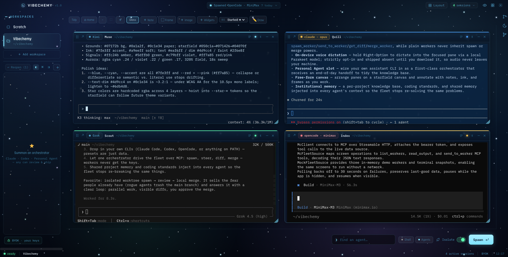

<div align="center">

# Vibechemy

### Command a fleet of CLI coding agents from one cockpit.

[](./LICENSE)
[-lightgrey?style=flat)](#what-it-is-not)
[](https://github.com/DiamondAlchemy/vibechemy/stargazers)
[](https://www.electronjs.org/)

Run Claude Code, Codex, Kimi and OpenCode side by side — each in its own git worktree,
in live terminals you can watch, steer, and merge.

[Quickstart](#quickstart) · [What it is](#what-it-is) · [Getting started](./GETTING-STARTED.md)



<sub><b>Four agents, four vendors, one workspace.</b> Each in an isolated git worktree, all visible at once.</sub>

</div>

---

If you've ever had three AI CLIs open in three terminals and lost track of who's doing what — this is
the cockpit for that.

## What it does

- **Every agent gets its own git worktree.** Spawn Claude Code, Codex, Kimi, OpenCode, Grok — or any
  command-based CLI — into an isolated worktree and branch. They can't step on each other, and they
  can't touch `main`.
- **You can see all of them working.** Real `tmux`-backed terminals on a freeform canvas: watch, type
  into, scroll, rearrange. No hidden background processes — if an agent is working, you see it working.
- **An agent can command the fleet.** Summon an orchestrator and it gets an authenticated MCP control
  plane — `spawn_worker`, `send_to_worker`, `get_diff`, `merge_worker`. Plain workers never inherit
  those tools, so nothing spawns or merges behind your back.
- **You approve every merge.** Review each worker's diff and merge it locally. Vibechemy never pushes.
- **The fleet remembers.** A per-project knowledge base, coding standards and shared memory are
  injected into every agent's context, so the fleet stops re-solving and re-breaking the same things.

*BYOK, always — Vibechemy drives your own CLI subscriptions. It detects that you're signed in and
never proxies, stores, or sees a token.*

## Why this exists

I'm not a career software engineer. I run a real business in a physical, regulated industry and I
needed to ship and operate my own software without a dev team. So I built the machine that lets one
operator command many coding agents at once — watch them work in real terminals, review their diffs,
and merge the good ones. **Vibechemy** is the open-source core of that machine: the orchestration
shell, with the business-specific and proprietary parts removed.

> **Who made this:** Built by [DiamondAlchemy](https://github.com/DiamondAlchemy).
> The full private rig runs my actual company; Vibechemy is the reusable core.

---

## What it is

A desktop app (Electron + React + TypeScript) that turns a wall of terminals into a controllable
fleet:

- **Terminal grid** — every agent runs in a real `tmux`-backed terminal you can watch, type into, and
  scroll. No hidden background processes; if an agent is working, you see it working.
- **Optional voice dictation** — hold Right-Option anywhere in the app, speak, then release; the
  transcript types into the focused terminal pane. A local Parakeet model runs fully on-device, so
  audio never leaves your machine. Voice is strictly opt-in: Vibechemy ships without the model and
  stays dormant until you download it (~600 MB) from **Settings → Voice**. If you do not want voice,
  simply never download it.
- **Spawn / steer / review** — launch an agent from a preset into its own **isolated git worktree**,
  send it follow-up instructions, view its diff, and merge it locally when it's good.
- **Agent roster** — bring your own CLIs (Claude Code, Codex, OpenCode — with an editable model
  roster covering any provider it supports — and any command-based agent). Settings
  shows which CLIs are installed and signed in, with Install / Log in buttons that launch the
  vendor's own flow in a visible terminal pane. Presets are data; add your own.
- **MCP control plane** — an authenticated Model Context Protocol server so an orchestrator agent can
  drive the whole fleet through tools (`spawn_worker`, `send_to_worker`, `get_diff`, `merge_worker`, …).
- **Personal Agent slot** — wire in your own assistant/agent CLI as a first-class orchestrator with an
  end-of-day handoff (see below).
- **Free-form canvas** — arrange panes freely on a starfield canvas, annotate with notes / ink / frames
  while you think.
- **Institutional memory** — a per-project knowledge base, coding-standards set, and shared memory that
  gets injected into every agent's context so the fleet stops re-solving and re-breaking the same things.
- **One consistent gesture contract** — the same click / scroll / select / copy behavior on every pane,
  no matter which CLI is inside it (see the cheat sheet below).

## What it is *not*

Vibechemy is the **core**, not a whole rig. Deliberately left out (they're business-specific or still
private): media/image generation, an always-on assistant brain, remote-rig control, and usage/billing
adapters. Features may flow out to this public repo over time, or they may not. No roadmap promises.

macOS-first (built and run on Apple Silicon). Not tested on Windows/Linux yet.

---

## Quickstart

macOS (Apple Silicon) — download, verify, and launch the latest release:

```bash
npx vibechemy
```

Or run from source on any platform:

```bash
git clone https://github.com/DiamondAlchemy/vibechemy.git
cd vibechemy
npm install
npm run dev        # launches the app in dev
```

Full walkthrough: [GETTING-STARTED.md](./GETTING-STARTED.md).

Then:

1. Register a project (point it at a git repo on your machine, or drag a folder from Finder onto the sidebar).
2. Open the agent roster and make sure at least one CLI agent is installed and signed in.
3. Spawn a worker — it opens in its own terminal, in its own git worktree.
4. Give it a task, watch it work, review its diff, merge it.

**Requirements:** macOS, **Node 20.19+ / 22.12+**, `tmux`, and at least one agent CLI on your `PATH`.
`npm install` compiles native modules (`better-sqlite3`, `node-pty`) from source, so you also need the
**Xcode Command Line Tools** (`xcode-select --install`) and **python3**.

## Connecting your agents (it's automatic)

There is no MCP setup step. Vibechemy **is** the MCP server: on first launch it generates an auth
token (stored owner-only in its app data as `mcp-token`) and starts an authenticated control plane on
`127.0.0.1:4880` (`4881` in dev). When you summon an **orchestrator** from the dock, the app writes
that CLI's own client config for it — Claude Code gets a generated `--mcp-config`, Codex gets inline
`-c mcp_servers.vibechemy.*` overrides, and so on — so the pane opens already holding the fleet tools
(`spawn_worker`, `send_to_worker`, `get_diff`, `merge_worker`, …) plus an operating briefing that
teaches it the protocol. The Personal Agent slot is wired the same way.

Two deliberate boundaries:

- **Workers never inherit the control plane.** Only summoned orchestrators get the tools; a plain
  worker pane is just the CLI, so it can never spawn or merge anything itself.
- **Bring your own keys.** The app never touches your credentials — install and sign in to each CLI
  yourself; Vibechemy only detects the result and lights up the roster.

Power-user path: any external MCP client can drive the same control plane directly — point it at
`http://127.0.0.1:4880/mcp` with `Authorization: Bearer <contents of mcp-token>`.

## The terminal gesture cheat sheet

Every pane behaves the same, whichever CLI is inside it:

| Gesture | What it does |
|---|---|
| **Click** an unfocused pane | Focus it — start typing immediately |
| **Scroll wheel** | Scroll that pane's own transcript / scrollback |
| **Option-drag** | Select text (auto-copies to clipboard) |
| **Right-click** | Copy / Paste menu |
| **⌘C / ⌘V** | Standard copy / paste |

The whole point: you never have to remember a different command per agent.

## The Personal Agent slot

Point the "Personal Agent" setting at your own assistant CLI (command + args + a display name). It
becomes a first-class orchestrator you can summon, and it receives an end-of-day handoff — a single
prompt telling it to pull the day's activity and tidy the knowledge base. It's the seam where your own
agent plugs into the cockpit; the app ships with the slot empty for you to fill.

---

## Architecture (one paragraph)

`src/main/` is the Electron main process (all the real logic — sessions, tmux, git, the MCP server,
the stores). `src/preload/` is the typed IPC bridge. `src/renderer/` is the React UI. `src/shared/` is
pure, Node-free domain logic that carries the unit tests. Every subsystem has a `shared/` half so its
logic is testable without touching live services. Start at `src/main/index.ts`.

## License

MIT — see [LICENSE](./LICENSE). Use it, fork it, build your own cockpit.
